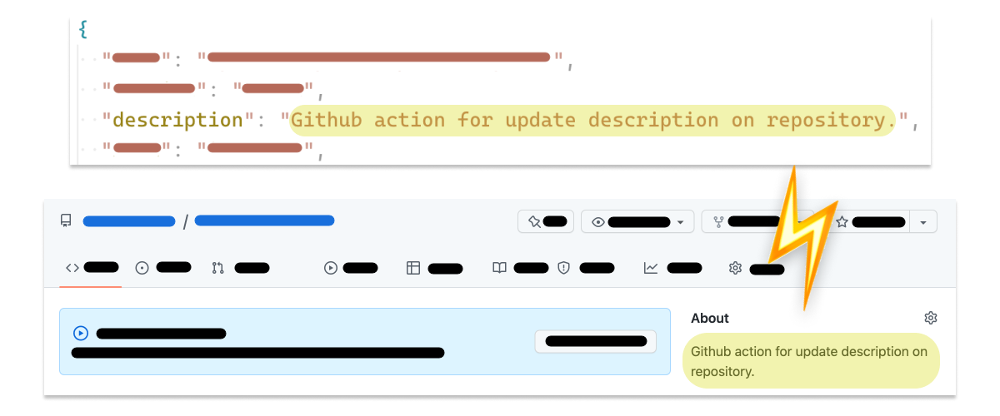

# Update Repository Description
[](https://github.com/zhengbangbo/update-repository-description/actions/workflows/main.yml)



## Usage

- [Example](./.github/workflows/main.yml)

```yaml
uses: zhengbangbo/update-repository-description@v1.0.0
with:
  repo-token: ${{ secrets.MY_TOKEN }}
```

> **Note**
> 
> This [job](https://github.com/zhengbangbo/update-repository-description/actions/runs/3318862036/jobs/5483297578) failed due to the following 3 points:
> 1. [The default  permissions granted to `GITHUB_TOKEN`](https://docs.github.com/en/actions/security-guides/automatic-token-authentication#permissions-for-the-github_token).
> 2. The workflows have read permissions in the repository for the contents and packages scopes only **by default**, which means to be restricted.
> 3. The related REST API belongs to [the administration scope](https://docs.github.com/en/rest/overview/permissions-required-for-fine-grained-personal-access-tokens?apiVersion=2022-11-28#repository-permissions-for-administration).
> 
> Summarized above, there are 3 ways to set the `repo-token`:
> 1. Select workflow permissions settings of a repo to the **Read and write permissions** option.
> 2. Generate a fine-grained personal access token with:
>    1. **All repositionries** of repository access.
>    2. **Read and write** access to Adminstration of repository permissions.
> 3. Edit the `ci.yml` with `permissions.contents: write`. [related](https://docs.github.com/en/actions/using-workflows/workflow-syntax-for-github-actions#permissions).

## License

MIT
